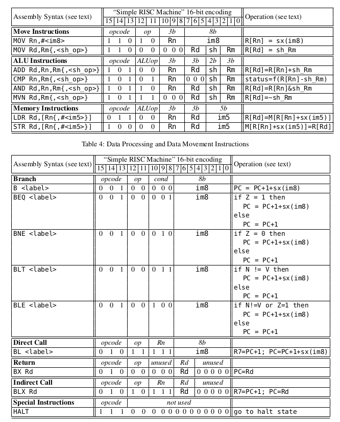

# The CPEN211 Backend 

This is the dead simple backend of CPEN211 ISA:



The entire instruction set is basically self explanatory. 

# TODO 

- [] Add a frame pointer support (**R5**), which is probably required by some calling conventions.
- [] Define a structure calling conventions.
- [] Deal with 8 bits variables
- [] Software floating point support 
- [] Lowering Shift 
- [] Lower not in Selection DAG
- [] Add Pseudo Instruction for NOT

## Technical Challenges

- Subtract requires a libcall which makes a lot of basic instruction hard to lower 
- The CPEN211 memory model is an unconventional one, where one byte is 16 bit. 
- Because one byte is 16 bit, it is hard to lower strings effectively. As of current, half of the memory space would not be used as a result!

## Calling Conventions Custom (C ABI)

Here we are going to define the calling convention:

**R7** is link register, **R6** is stack pointer, and **R5** is frame pointer. 

Argument register are **R0**, and **R1**. 

Return happens at R0.

Additional arguments are passed on the stack in reverse order. 

## Example

```
int add(int a, int b, int c, int d){
    return a + b + c;
}
```


At the beginning of the add, it is the caller's responsibility to lower the stack frame into the following:  

```
R0  :       int a
R1  :       int b
SP-2:       R7 // Link Register
SP-1:       int c
SP  :       int d
```
